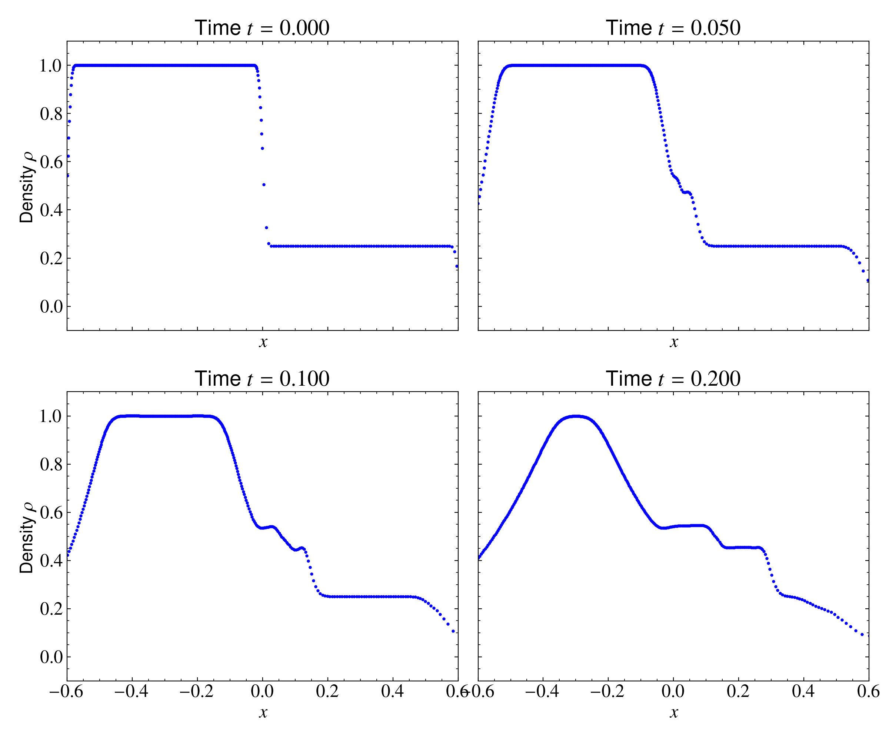
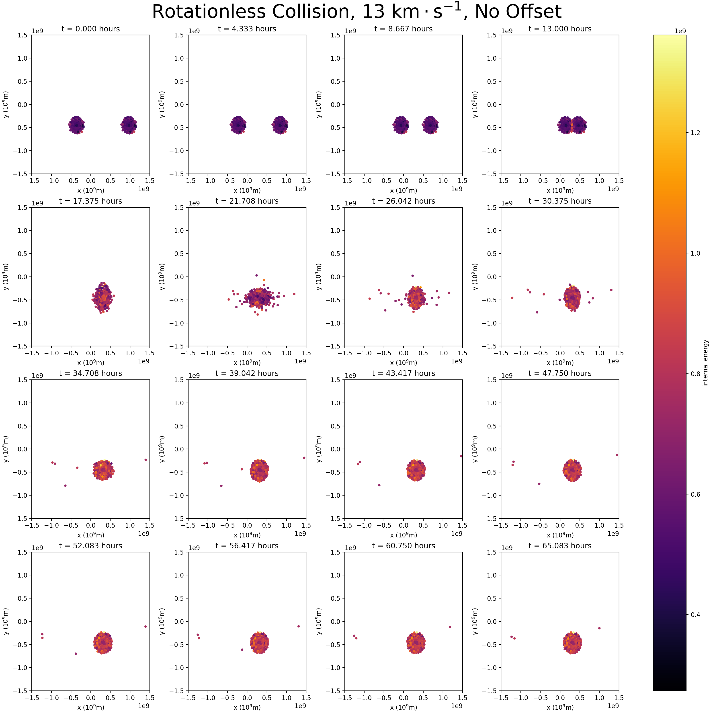
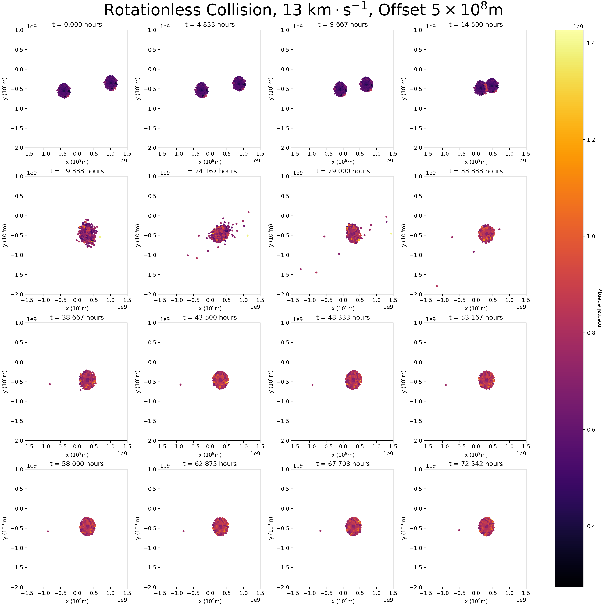

# Collinding Planets with SPH

This project implements a Smoothed Particle Hydrodynamics (SPH) solver for fluid dynamics and astrophysics simulations. It includes tools for simulating shock tubes, relaxing planetary bodies, and modeling high-velocity planetary collisions.


Differential equations are everywhere in physics. However in some cases in astrophysics, solving the differential equations becomes too complicated due to the size of the systems and its parameters. Whilst for small cases it is possible to model each particle individually, for larger systems this is computationally infeasible due to the computation time. Hence, Smoothed Particle Hydrodynamics (SPH, Monaghan 1992) was introduced. This simulation method is used to study, among other things fluid flows and mechanics. In this project, we will apply SPH to two use cases: firstly we will numerically solve the Sod's shock tube problem. This is a one-dimensional problem, and can test the validity of the SPH by testing the results against the theoretical solution. Once our SPH code has been verified, we will simulate a three-dimensional collision with two planets, each of which has been relaxed, by extending our Sod shock code to three dimensions, and adding an additional gravity term. 


Smooth Particle Hydrodynamics, SPH, is commonly used in astrophysics to solve differential equations. It is a meshfree, Lagrangian method and represents a fluid as a set of discrete particles. Each of these particles can carry different physical properties, such as mass, density and pressure. 

## Sod shock tube problem
As the implementations of SPH can differ greatly, one needs some kind of landmark to check the validity of the SPH implementation. For this, the Sod shock tube problem is commonly used. One can test their implementation with the Sod shock problem, to see if it works in one dimension before moving to more difficult to verify three-dimensional problems. Because the Sod shock has an analytical solution, it is easy to verify the code (Backus 2017)

The Sod shock test consists of a one-dimensional tube with a membrane separating to systems, each of which has gas with a different density and pressure and is initially in thermal equilibrium. When the membrane is removed, we produce a shock wave into the lower density region, a refraction wave into the higher density region and a contact discontinuity that travels behind the shock wave. For the specific differential equations and parameters used, we refer to the lab manual: 


To resolve the discontinuities and prevent unphysical oscillations, we implement artificial viscosity $\Pi_{ij}$, with parameters $\alpha_\Pi = \beta_\Pi = 1$ and a factor $\phi = 0.1 h_{ij}$ to prevent numerical divergence. The artificial viscosity term is added to the velocity and energy equations. For the interpolation, we use a cubic spline kernel $\bm{W}_{ij}$, a constant smoothing length of $h = 0.015$ and an ideal gas with an adiabatic index of $\gamma = 1.4$. The spline is given by 

$$W(R, h) = \alpha_d \begin{cases}
        \f{2}{3} - R^2 + \f{1}{2} R^3 & 0 \leq R < 1\\
        \f{1}{6}(2-R)^3 & 1 \leq R < 2\\
        0 & R \geq 2,
    \end{cases}$$

where $\alpha_d$ is $1/h$ in one dimensions and $3/(2\pi h^3)$ in three dimensions, and $R = r / h$ the relative distance between points with respect to the smoothing length. 

## Colliding Planets

To verify the functionality of our code for a three-dimensional planet, we kept the same code base as the shock tube problem and worked on adding a gravity term to the velocity update. First, we set this term to zero, to retrieve the expected result that with no boundary conditions and no gravity (i.e. only pressure and artificial viscosity act), the planet would rapidly expand. This involved recalculating the kernel matrix $\bm{W}_{ij}$\footnote{Notation: $\bm{W}_{ij}$ is a two-dimensional matrix with three-dimensional vector components, `NumPy` shape ($N\times N\times 3$), where $N$ is the number of particles.} and its time-derivative. Special consideration had to be paid to the smoothing length $h$, which had to be much larger to apply correctly to an astronomically-sized body (this was solved by informed trial-and-error). We also made sure to set negative particle energies (a result of singularity close to the center of the planet) to slightly above zero during their individual updates, and, to make sure the diagonal elements of the distance matrix $d\bm{x}_{ij}$ were not $0$, we set the distance between each particle and itself to be $1$. This does not significantly change the mathematical calculation but avoids runtime warnings.

Having accomplished this, we re-implemented gravity as a simple addition to the velocity update term (that is, an acceleration), synthesizing the given time-derivative of the gravitational potential. For the exact form of the extra term, we refer the reader to the lab manual: 


For one test planet, this threw off a fraction of the outermost layer of particles, but caused the rest of the particles to infill and oscillate until equilibrium. Once the single planet was stable, we cloned its initial conditions and translated the position of the clone to a short distance away. We then added a constant initial velocity to each particle, inverting this for the second planet and sending them careening towards one another.

To prevent numerical instability on our relatively low-resolution simulation, we assert $e > 0$, and set the internal energy $e$ to be slightly above zero where $e$ gets negative. Furthermore, we set $r_{ii}$ to one, to ensure numerical stability for self-interactions.


## File Overview

### Core Physics & Solvers
* **`sph_core.py`**: The engine of the simulation. Contains the `SPHParameters` class and the `RK45Solver`, which handles density summation, pressure gradients, and artificial viscosity.
* **`sod_shock.py`**: A specialized script for running the 1D Sod Shock Tube benchmark. It compares the SPH results against analytical "exact" solutions.
* **`grav_planets.py`**: Extends the SPH logic to 3D with gravity. Used for simulating the interaction and collision of astronomical bodies.

### Data Preparation & Management
* **`save_planet.py`**: Takes the output of a "relaxation" run and saves it as a stable, initial-state planet file.
* **`save_collision.py`**: Clones a relaxed planet and sets up a two-body collision scenario with specific separation and impact speeds.
* **`save_collision_impact_param.py`**: An advanced version of the collision setup that allows for "grazing" or "oblique" impacts by adjusting the impact parameter ($b$).

### Post-Processing & Visualization
* **`plotter.py`**: Generates multi-panel snapshots of simulation results, focusing on internal energy distribution over time.
* **`plotter_dat.py`**: A utility to visualize raw `.dat` particle files, calculating internal energy from pressure and density.
* **`get_data.py`**: Extracts physical properties (Center of Mass, Mass-Radius, Density) from simulation result pickles.

## How to Run

### Setup
Ensure you have the dependencies installed:
```bash
pip install -r requirements.txt
```


### Run pipeline

To run the pipeline of colliding planets, one can use

```bash
python3.12 run_pipeline.py
```

## Results

### Sod shock tube problem

We will first test the Sod shock tube problem to see if our SPH code works as expected. To solve the differential equations, we use the RK45 solver in `scipy.integrate.solve_ivp`, with a tolerance $10^{-8}$ and the fourth-order Runge-Kutta integrator (Fehlberg,1969). We plot the density, pressure, internal energy and velocity over $x$ to see if they align with the exact solution. We run the simulation for $t=0.200$ (arbitrary units), with a starting domain of $[-0.60, 0.60]$ (arbitrary units) and no boundary conditions. A smoothing length of $h = 0.015$ and a timestep of $0.005$ was used. The exact solution is generated by the \lstinline{sodshock} Python package from (Backus, 2017), which is openly available on GitHub:  \url{https://github.com/ibackus/sod-shocktube}. The result can be seen in the Figure below. In the top left we can see the density, in the top right the pressure, in the bottom left the internal energy and in the bottom right the velocity against position $x$. It can be seen that the solution of our SPH follows the exact solution relatively closely. 




### Colliding Planets
We begin by treating the single-planet case, obtaining a relaxed planet that minimized internal energy over a large time interval, which is essentially a variant of the shock tube with different initial conditions and extra dimensions. Checking that the planet contracted over time is critical to verifying that the gravity calculation was working correctly (we refer to this as being a ``cold'' planet), and once this is solved, we clone the planet and placed each copy at a reasonable distance from one another ($\approx5\times10^9$ meters away from eachothers' outermost point). In our experiment, we decide to use speeds of $13$ kilometers per second, which is close to the linear velocity of Jupiter in the Sun's reference frame. Furthermore, after multiple experiments with different smoothing lengths, we decided on a smoothing length of $5 \cdot 10^7$, and $10^5$ steps after relaxation of $150$ seconds. The result of the planet collision can be seen in the figure below: 



We also ran the simulations again with an added offset of $5\times10^8$ meters. These results are in the figure below: 



We calculate the initial radius of the planet as the norm of the initial positions after relaxation, noting that some outliers will make the planet appear slightly larger numerically than its true size. We calculate the center-of-mass by taking the average of these positions weighted by their mass, and then sort the particles by distance from this point. We then cut the final 10\% to avoid the outlier particles ejected during relaxation (this is likely a bit draconian --- there are very few such particles, $\approx 10$). Finally, we sum the remaining particles to obtain the total initial mass, and then calculate the density by assuming the particles form a sphere of the initial radius.  

For the final planet, we choose to include only bound particles, having total energy per particle less than zero. We calculate this as

$$E_i=m_i\left(\frac{v_i^2}{2}+\Phi_i\right),$$

where 

$$\Phi_i=-G\sum_{i\neq j}\frac{m_j}{r_{ij}}$$

is calculated after shifting to the approximate center-of-mass frame. The results are then calculated in the same way as for the initial data.

#### Head-On Collision
| | Mass (kg) | Radius (m) | Density (kg·m⁻³) |
| :--- | :---: | :---: | :---: |
| **Initial State** | $1.75\times10^{27}$ | $6.41\times10^{8}$ | $1.58$ |
| **Final State** | $3.44\times10^{27}$ | $5.34\times10^{8}$ | $4.01$ |

> **Note:** The outer solar system has densities on the order of $1000\;\text{kg}\cdot\text{m}^{-3}$ (NASA, 2026), so our densities are actually rather ridiculous for planets of this size. This is likely due to the issue of using too few, too-large particles, or perhaps a flaw in our density calibration.

---

#### Offset Collision
| | Mass (kg) | Radius (m) | Density (kg·m⁻³) |
| :--- | :---: | :---: | :---: |
| **Initial State** | $1.75\times10^{27}$ | $6.41\times10^{8}$ | $1.58$ |
| **Final State** | $3.42\times10^{27}$ | $3.09\times10^{8}$ | $27.77$ |

> **Note:** The density has jumped to eighteen times as large, and the final radius is much smaller. The order of mass loss is only $2\times10^{25}$ kg larger compared to the head-on collision.


## Discussion

### Sod shock tube problem

As we have seen, the Sod shock tube solution of our SPH code looks like we would expect it to, and aligns relatively well with the exact solution. We can see a jiggle on the pressure-distance plot around $x=0.015$, which is thought to be caused by the smoothing length, which is also set to $h = 0.015$. 

The absence of boundary conditions can be clearly seen, as at higher $|x|$ the solution drops in pressure, density and internal energy. However, as we only integrate to $t=0.200$ and the problem is just a verification for the three-dimensional planet problem, we do not consider this to be a problem. 

### Colliding Planets
We note that, for the planetary collision, the initial impact involves the planets flattening to around half their initial radii. This makes sense intuitively; however, what was surprising is that the planet actually appears to oscillate as it bleeds mass and kinetic energy before it settles into a final, spherically symmetric form. Particles that end up far from the center of mass are ejected, and even the settled planet is still kinematically very hot --- though total ejected mass is only 6\% of the initial combined mass, which is unexpected. (Running another simulation with faster initial velocities, or more total particles, should increase this figure). 

Even more surprising is that the final radius of the planet is actually smaller than the initial radius, and the density is more than three times greater, even after allowing the planet to settle for another few hundred hours\footnote{In retrospect, this is of course far too short of a time allowance for settling after a planetary-scale collision. We are limited by our ability to simulate over such timescales.}. This is perhaps due to a mix of the compression during impact and the blasting-away of the outer, less dense layer of particles from the initial conditions. The pressure of particles pushing each other away is not sufficient to compensate from the shock of the initial impact, which is a key insight in understanding the dynamics of planetary-scale collisions, though the scale and duration of the oscillations about equilibrium is likely to be highly sensitive to the initial conditions (namely, the initial masses, impact velocity, and offset.)

For the offset case, more mass is lost, and the total energy retained by lost particles is large, as they fly further from the center of mass faster. However, oscillations are of a more similar scale than expected (it might be thought that the edge particles are kicked further from the center of mass at higher velocity and then take longer to settle). The density has increased significantly, lending credence to our theory that the blasting away of the outer, less-dense layers of particles is more severe in the case of the offset collision, leading to a denser final body. This is very interesting, given that the offset collision is likely more physical.

We make a note of several key underlying assumptions and simplifications in our model; the most critical being that planetary collisions of this scale should almost certainly be treated as a three-body problem, with both planets being in orbit around a larger body that adds its own contribution to the potential. This means the head-on trajectory is highly nonphysical, as planets should form within a protoplanetary disk where the conservation of angular momentum leads them to orbit in the same direction --- more likely is a glancing blow with one planet traveling more quickly through the region of space where the collision takes place. This can somewhat be remedied by adding the offset term, but the relative velocity difference is still critical. We also assumed that the relaxed state of the final body is spherically symmetric in our density calculations, though this is much easier to motivate, as the gravitational potential that the planet sits in is itself spherically symmetric. The most likely culprit for any numerical artifacts is the assumption that the total mass of the planet is the total mass contained with in 90\% of the normalized radius (for example, increasing this figure leads to densities that are orders of magnitude smaller, which was discounted under the assumption that more of the thrown-off particles are mistakenly included in this calculation).

Also of note in our final simulations is that we used the smallest possible planet, of only $N\approx300$ particles, due to limitations in time and our ability to simulate. Not only would a larger number of particles be closer to physical reality, but we theorize that such simulations would also end with a much larger fraction of ejected particles. This is because large, massive particles that end up packed just as tightly as less massive particles should pull on each other much harder, increasing the gravitational cohesion of the final body. Overall, our simulations are actually highly nonphysical, but simple results as to some of the expected behaviors of astrophysical collisions are still applicable.

## Conclusion
By looking at the Sod shock tube solution, we concluded that our SPH code works as it should in one dimension. Therefore, we could continue to the problem of colliding planets. Here, we discovered that it can take seeded particles some time to settle into equilibrium, and relaxation is necessary to obtain physical results from simulations. We found the less mass is ejected in head-on collisions than expected, perhaps due to the lack of extra angular momentum to drive particles on the edge of the planet close to escape velocity. Finally, we discovered that these collisions can result in an even denser remanent, with its less dense outer layers entirely blasted off, and the surviving body only retains the densest layers compressed during the shock of collision. (This is similar to the proposed formation of Mercury investigated in (Benz, 2007), though that would have been a much smaller-scale collision.) 


